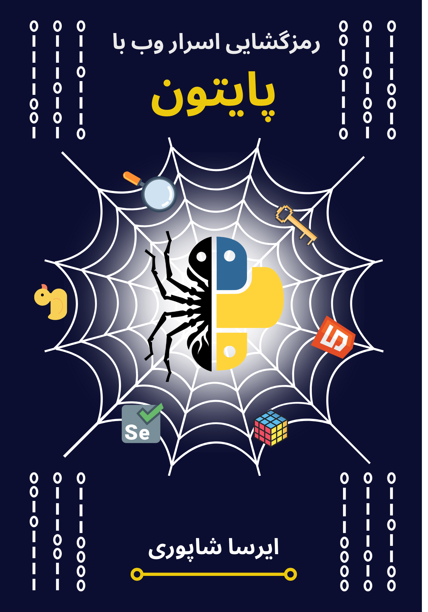

# Decoding the Secrets of the Web with Python

This repository serves as the official code companion for the book [Decoding the Secrets of the Web with Python](https://irsashapouri.com/Decoding-the-Secrets-of-the-Web-with-Python.pdf) published by [Elmodanesh](https://elmo-danesh.ir). It contains all the necessary code examples, data files, and supporting materials required to follow along with the book from start to finish. Readers can leverage this repository to enhance their learning experience and reinforce the concepts covered in the book through practical implementations.

  

## About the Book
Decoding the Secrets of the Web with Python offers a comprehensive exploration into the realm of web data extraction and automation using the Python programming language. Spanning six meticulously crafted chapters, the book serves as a guide for both beginners and seasoned developers alike. Beginning with an introduction to the fundamental concepts of web scraping and data extraction, readers are gradually acquainted with the necessary tools and techniques. Subsequent chapters delve into the intricacies of HTML and CSS decoding, leveraging the power of libraries such as BeautifulSoup and Requests. Furthermore, the book provides extensive coverage of advanced automation methodologies facilitated by the Selenium library. With a focus on practicality and real-world application, Decoding the Secrets of the Web with Python equips readers with the skills and knowledge essential for navigating the intricacies of the digital landscape with confidence and proficiency.

## Table of Contents

  

## Contributing
If you find any issues with the code examples, have suggestions for improvement, or would like to contribute additional resources, feel free to open an issue or submit a pull request. Contributions from the community are highly encouraged and appreciated!

## Support
If you have any questions about the book or need assistance with any of the code examples, please don't hesitate to reach out by opening an issue in this repository.